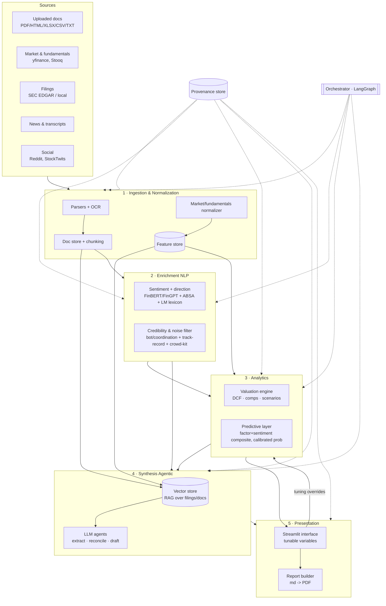

# Equity Intelligence Platform — System Architecture

> **What this is.** A blueprint for generalizing the PayPal research engine into a
> reproducible platform that produces a defensible, model-backed research view on
> **any** public company from (a) the documents a user uploads and (b) live data the
> system pulls. It fuses **fundamental valuation**, **NLP/sentiment with direction**,
> **source-credibility / signal-vs-noise filtering**, and **calibrated predictive
> analytics**, synthesized by **agentic workflows on locally-hosted LLMs**, surfaced
> through a **tunable interface** whose controls map directly to the visualizations
> and the generated report.
>
> **Design north star (inherited from the PYPL build):** the report is the product;
> the engine makes every number defensible. **No fabricated figures** — every output
> traces to a cited source or a stated assumption. Predictions are **probabilistic and
> calibrated**, never point-forecast hype.

---

## 0. Reading guide

- §1 Principles — the non-negotiables that shape every choice.
- §2 The big picture — one diagram, the six layers, how data flows.
- §3–§9 Each layer in depth (mechanics + the research behind the technique choices).
- §10 Interface (tunable variables → visualizations → report).
- §11 Local-LLM & agentic stack. §12 Data model. §13 Integrations table.
- §14 Reliability/integrity. §15 Phased build roadmap. §16 Honest limitations.

---

## 1. Design principles

1. **Config/registry-driven, company-agnostic.** Today `config.yaml` hard-codes PYPL.
   The platform splits this into a *company registry* (ticker, CIK, peers, sector
   template) + a *global settings* file + *per-run overrides*. Adding a company =
   adding a registry entry, not editing code.
2. **Provenance or it didn't happen.** Every datum carries `{source, url, retrieved_at,
   confidence}`. The PYPL `data/raw/_manifest.json` pattern generalizes into a
   first-class provenance store. The UI can trace any number back to its source span.
3. **Deterministic numbers, generative prose.** LLMs *never* do arithmetic or invent
   figures. A deterministic Python layer (pandas) computes all numbers; LLMs only
   *retrieve, classify, extract, and draft narrative grounded in those numbers* — and
   must cite the source span for every claim.
4. **Calibrated honesty over false precision.** Predictive outputs are probabilities
   with confidence bands, validated with leakage-safe backtesting (purged CV, Deflated
   Sharpe). The system is built to *say "I don't know / low confidence."*
5. **Local-first, hybrid-capable.** Private uploaded documents are processed locally
   (privacy); only the hardest final reasoning may optionally route to a cloud model
   with sensitive spans redacted.
6. **Reproducible & inspectable.** One command (or one button) reconstructs every
   output from cached raw data; the interface exposes the knobs, not a black box.

---

## 2. The big picture

The platform is a **6-layer pipeline** with a control plane (orchestration) and a
presentation plane (interface + reports). Data flows left-to-right; the interface
reads the whole stack and writes back tuning overrides that re-run downstream layers.



**Automation in one paragraph.** A run is a DAG executed by the orchestrator: ingest &
normalize → enrich (sentiment + credibility) in parallel with analytics (valuation +
prediction) → agents reconcile/extract/draft against a RAG index → the interface renders
visualizations and the report builder emits the note. Each node is cached and
idempotent; changing a tuning variable invalidates only the downstream nodes, so the
UI updates valuation/visuals in near-real-time without re-pulling data.

---

## 3. Layer 1 — Ingestion & Normalization (“draw + filter data”)

**Goal:** turn anything the user has (or the web exposes) into clean, typed,
provenance-tagged records the rest of the system consumes.

**Uploaded documents (the "any company with relevant docs" requirement).**
- Parsers: `pdfplumber`/`PyMuPDF` (text+tables from PDFs), `python-docx`, `openpyxl`
  (XLSX models/exports), `BeautifulSoup`/`lxml` (HTML filings), `pandas` (CSV).
  OCR fallback for scanned PDFs via `pytesseract`/`ocrmypdf`.
- A **document classifier** (rules + small LLM) tags each file: filing (10-K/10-Q/8-K),
  earnings-call transcript, investor presentation, news, analyst note, or "financial
  model". This routes it to the right extractor.
- **Structure-aware chunking** (per the RAG research): split filings by section
  (MD&A, Risk Factors, statements), 512–1,024 tokens, ~20% overlap, tables kept intact,
  metadata `{ticker, period, section, source_file, span}` on every chunk.

**Live pulls (reuse + extend the PYPL `data_loader`).**
- Market & fundamentals: `yfinance` (backbone), `Stooq`/`pandas-datareader` (redundancy),
  SEC EDGAR XBRL `companyfacts` (ground-truth financials + validation), FRED (rates).
- News/transcripts/social: see §13 integrations table.

**Validation gate (generalized from PYPL).** Cross-check API figures (revenue, net debt,
shares) against EDGAR/uploaded filings; flag and quarantine mismatches rather than
trusting one source — exactly the discipline that caught yfinance's wrong operating
income for PYPL.

**Output:** a typed **feature store** (per-company, point-in-time) + a **document store**
(chunks + embeddings) + provenance records.

---

## 4. Layer 2a — Sentiment with **direction** (not just polarity)

Polarity ("positive/negative") is not a view. A *directional* signal needs three
sub-layers (per the financial-NLP research):

1. **Domain tone model.** `FinBERT` (fast baseline, runs on CPU) ensembled with a
   `FinGPT`/Qwen-LoRA model that can emit *graded* bullish/bearish + a rationale.
   `SetFit` head fine-tuned to a custom **conviction rubric** for few-shot adaptation.
   *(FinBERT: huggingface.co/ProsusAI/finbert · FinGPT: arXiv:2306.06031)*
2. **Aspect-Based Sentiment (ABSA)** so "margins ↑, guidance ↓, litigation ↑" are scored
   separately rather than averaged into mush. `PyABSA` for canonical aspects + an
   instruction-tuned local LLM for open-aspect extraction. *(PyABSA: arXiv:2208.01368)*
3. **Lexicon overlay & hard cases.** Loughran–McDonald financial dictionary
   (negative/uncertainty/litigious/modal counts) as explicit risk features and negation
   handling — generic-English sentiment misclassifies finance text. *(L&M: Loughran &
   McDonald 2011, JF; sraf.nd.edu)*

**Direction comes from tone *relative to a baseline*, not absolute tone:**
- **Tone vs. expectations:** sentiment minus consensus/analyst expectation.
- **Tone Δ vs. prior filings:** quarter-over-quarter change in MD&A/risk-factor tone or
  10-K year-over-year textual similarity (the "Lazy Prices" effect: firms that change
  their filing language tend to underperform). *(Cohen, Malloy & Nguyen 2020, JF)*
- **Event tone:** earnings-call Q&A tone, which predicts post-announcement drift.
  *(PEAD.txt, Phila. Fed WP21-07)*

**Output:** a signed, z-scored **sentiment signal** per company per period, decomposed by
aspect and by source-type (filing/call/news/social), each with a confidence.

> *Honest caveats baked in:* published sentiment edges are small, regime-dependent, and
> decay; weight filings/calls above social; pin model cutoffs to avoid look-ahead;
> Loughran–McDonald and some model weights have licensing limits for commercial use.

**Implemented today (`src/sentiment.py`, P4 done).** Three interchangeable tiers behind one
output shape: `lexicon` (L&M-style seed, zero-dep default), `finbert` (optional), and `llm`
(graded tone + conviction + open aspects + rationale via Ollama — **live on the Spark**, see
§11). Aspect attribution and source-type weighting (filings > calls > news > social) are in;
Δtone-vs-prior is wired (`prior_tone`). Still aspirational: tone-vs-consensus, PyABSA/SetFit
conviction head, and the z-scoring/event-study calibration — these layer on in P5/P7.

---

## 5. Layer 2b — Signal vs. noise & **source credibility**

The system must *down-weight unreliable or manipulative nodes*, not treat every post
equally. Pipeline (per the credibility research), cheapest filters first:

1. **Quality gate:** language ID (fastText `lid.176`), relevance gate (cashtag match,
   drop ≤N-post tickers), spam/low-info heuristics, near-duplicate **dedup**
   (MinHash+LSH via `datasketch`; semantic dedup via embeddings).
2. **Account credibility score** = **track-record weight** (label past calls vs. realized
   returns — the strongest signal, free on Reddit/StockTwits) × **bot/metadata discount**
   (gradient-boosted soft features: account age, follower ratio, burstiness; graph models
   like BotRGCN/BotMoE where a follower graph exists) × **centrality prior**
   (PageRank/TrustRank seeded from vetted accounts for cold-start).
   *(Track-record: Bar-Haim et al. EMNLP-2011; TrustRank VLDB-2004; BotMoE arXiv:2304.06280)*
3. **Coordination / pump-and-dump layer:** build an account-similarity network from shared
   traces (cashtags, links, near-identical text, synchronized timing); flag dense clusters;
   corroborate with a **market-coupled spike detector** (joint price+volume+chatter spike).
   *(Pacheco et al. ICWSM-2021; equities P&D arXiv:2301.11403)*
4. **Aggregation under uncertainty:** combine many noisy sources with a Bayesian
   truth-discovery model — `crowd-kit` Dawid–Skene / MACE (down-weights spam & directional
   bias) or CATD for sparse sources — then online inverse-variance weighting as outcomes
   resolve. *(crowd-kit: github.com/Toloka/crowd-kit)*

> *Critical caveat (built into the design):* **organic ≠ manipulative.** High volume/
> synchrony is normal for legitimate retail consensus (GME/AMC were largely organic).
> Require authenticity *or* content-duplication corroboration before suppressing a signal,
> or you delete the real thing. X/Twitter graph features are now paid; **Reddit +
> StockTwits are the free credibility backbone.**

**Output:** a **credibility-weighted sentiment aggregate** per company, plus a
"manipulation risk" flag and the list of nodes driving (and excluded from) the signal.

---

## 6. Layer 3a — Valuation engine (generalized)

The existing PYPL modules (`financials`, `wacc`, `dcf`, `comps`, `scenarios`, `charts`)
become **company-agnostic services** driven by the registry + sector templates:
- **Sector templates** handle structural differences (e.g., financials/REITs use
  different frameworks — the platform refuses a naive DCF for a bank and routes to a
  dividend/residual-income or NAV model, mirroring the brief's "avoid banks" guardrail
  automatically).
- WACC pulls the live risk-free per the company's currency; ERP per region.
- Comps auto-builds peer multiples; sector template defines the relevant multiples.
- Outputs identical artifacts to the PYPL build (DCF intrinsic, comps, sensitivity,
  football field, scenarios) for any ticker.

---

## 7. Layer 3b — Predictive analytics (calibrated, honest)

A **cross-sectional, point-in-time** model that outputs a **calibrated probability of
positive forward excess return** with confidence — *not* a price prediction.

- **Features:** fundamental factors (value, quality, profitability, momentum) +
  filing tone (L&M) + 10-K YoY textual change + credibility-weighted news/social
  sentiment + earnings-surprise/PEAD signal.
- **Model:** gradient-boosted trees (LightGBM) for a probability, **isotonic/Platt
  calibration**, conformal bands for uncertainty.
- **Validation (anti-overfit, mandatory):** walk-forward + **purged/embargoed CV**
  (López de Prado), report **Information Coefficient, hit rate, Deflated Sharpe Ratio,
  and Probability of Backtest Overfitting** net of assumed costs; liquidity-filter the
  universe. *(Gu, Kelly & Xiu 2020, RFS; López de Prado purged CV)*

> *Stated plainly in every report:* per-name out-of-sample R² is well under 1%; most
> academic alpha lives in microcaps/short legs and fades after costs; public text is
> largely priced in (semi-strong EMH). The predictive layer is a **probabilistic tilt
> with confidence**, a complement to the fundamental view — never a market-timing claim.

---

## 8. How the four signals combine (the synthesis logic)

The platform does **not** average a DCF with a tweet. It keeps the views *distinct and
attributable*, then reconciles:

| View | Drives | Confidence source |
|---|---|---|
| **Fundamental valuation** | the price target & rating | assumption transparency + sensitivity |
| **Sentiment (directional)** | near-term catalyst/skew, scenario probabilities | source mix + magnitude |
| **Credibility filter** | *trust weighting* applied to sentiment | bot/coordination/track-record |
| **Predictive model** | a calibrated directional tilt + confidence | backtest IC / calibration |

Reconciliation: the **valuation** sets intrinsic value and the 12-month target; the
**sentiment + predictive** signals inform **scenario probabilities** and a "timing/skew"
overlay (e.g., shift bull/base/bear weights when credible sentiment and the calibrated
model agree). Disagreements are surfaced, not hidden ("fundamentals say cheap; sentiment
& momentum say falling knife → flag, don't average away").

---

## 9. Layer 4 — Orchestration & agentic synthesis

- **Orchestrator:** `LangGraph` — a stateful DAG with caching, retries, and
  human-in-the-loop checkpoints (mirrors the PYPL phase-gates).
- **Agents (typed, tool-using):**
  - *Ingestion agent* — classify & route uploaded docs.
  - *Extraction agent* — pull specific figures from filings (e.g., TPV, segment revenue)
    with **citations to chunk IDs**; returns "not found" rather than guessing.
  - *Reconciliation agent* — compare API vs. filing vs. uploaded numbers; raise conflicts.
  - *Narrative agent* — draft each note section grounded **only** in computed numbers +
    retrieved spans, with inline citations.
- **Reliability:** structured output via `PydanticAI` + `Instructor`/`Outlines`
  (schema-constrained decoding), auto-retry on validation failure, and a rule that the
  deterministic Python layer owns all arithmetic.

---

## 10. Layer 5 — Interface (tunable variables → visualizations → report)

**Framework:** `Streamlit` (fastest path to an interactive, Python-native analytics app;
`Plotly` for interactive charts). Optional `FastAPI` backend later if multi-user.

**Layout (wireframe):**
```
┌───────────────────────────────────────────────────────────────────────┐
│  [Ticker ▼]  [Upload documents ⬆]   [Run ▶]      Rating: BUY  PT $59    │
├──────────────┬────────────────────────────────────────────────────────┤
│  CONTROLS     │   TABS:  Summary | Valuation | Sentiment | Predictive |  │
│  (left rail)  │          Comps | Documents | Report                      │
│               │                                                          │
│  Valuation    │   ┌── interactive charts (Plotly) ──────────────────┐   │
│   WACC   ●──  │   │  football field · DCF heatmap · scenario bars    │   │
│   g      ●──  │   │  sentiment timeline · credibility breakdown      │   │
│   margins ●─  │   └──────────────────────────────────────────────────┘   │
│   rev gr  ●─  │                                                          │
│  Scenarios    │   Live KPIs update as you drag sliders ↓                 │
│   bull/bear%  │   Intrinsic $94 · Target $59 · Upside +42% · R/R 6.8x    │
│  Sentiment    │                                                          │
│   src weights │   [Generate report ⬇ PDF]                                │
│  Predictive   │                                                          │
│   horizon     │                                                          │
└──────────────┴────────────────────────────────────────────────────────┘
```

**Tunable variables → mapping (the explicit requirement).** Every control is a config
override; moving it re-runs only the affected analytics node and re-renders the bound
visualization in real time:

| Control | Re-runs | Visualization it maps to |
|---|---|---|
| WACC, terminal g | DCF | football field, sensitivity heatmap, KPI target |
| revenue growth, margins | DCF projection | revenue/margin charts, intrinsic value |
| bull/bear probabilities | scenario weighting | scenario bars, prob-weighted target |
| sentiment source weights | credibility aggregation | sentiment timeline, signal gauge |
| credibility thresholds | noise filter | included/excluded-nodes table, manipulation flag |
| predictive horizon/universe | predictive model | probability gauge + confidence band |

Because numbers are deterministic and cached, slider moves are sub-second. The **report
builder** snapshots the *current* tuned state → markdown → PDF (the existing
pandoc/tectonic pipeline), so the exported note always matches what's on screen.

---

## 11. Local-LLM & agentic stack (DGX Spark — empirically tuned 2026-06-16)

**Deployment target: NVIDIA DGX Spark (GB10, 128 GB unified LPDDR5X).** The whole platform
— code *and* inference — runs natively on the Spark (aarch64); private filings never leave
the box. Cloud is an optional escape hatch for the hardest final reasoning only (sensitive
spans redacted).

**The one hardware fact that drives every model choice: the GB10 is *bandwidth*-bound, not
*capacity*-bound.** 128 GB of unified memory fits almost anything, but at **~273 GB/s** a
**dense** model must stream *all* its weights per token, so throughput collapses as size
grows (measured here: dense `qwen2.5:32b` ≈ **9–11 tok/s**). A **Mixture-of-Experts** model
reads only its few *active* params per token and is **~8× faster at comparable quality**
(measured: `qwen3:30b-a3b-instruct-2507`, 3.3 B active ≈ **89 tok/s** warm). →
**Principle: MoE-first; choose by *active* params, not total size.** This inverts the old
"biggest dense model that fits" heuristic that the previous draft assumed.

**Two serving runtimes, split by job:**

| Runtime | Model(s) | Used for | Why this runtime |
|---|---|---|---|
| **Ollama** (`:11434`) | `qwen3:30b-a3b-instruct-2507` (non-thinking instruct) | synchronous strict-JSON path: **sentiment, doc classification, figure extraction** | one-line pulls, OpenAI-compatible, schema-constrained `format`; *non-thinking* → clean `json.loads`, no `<think>` leakage |
| **vLLM** (separate port) | `qwen3.6:35b-a3b` / `gpt-oss-120b` (FP8 / NVFP4) | **agentic + RAG layer (P6)**: tool-calling, multi-step reasoning, batch drafting | guided-JSON + reasoning parsers, high concurrency, 256K context; sidesteps Ollama's thinking-+-`format` bug (#14645) |

**Model roster (all local on the one box), by task tier:**

| Tier | Model | Arch / active params | ~tok/s on GB10 | Task |
|---|---|---|---|---|
| Light | `qwen2.5:0.5b` (or similar) | dense, <1 B | very fast | smoke tests, trivial classify |
| **Workhorse** | **`qwen3:30b-a3b-instruct-2507`** (Q4_K_M) | MoE, **3.3 B** | **~89** | sentiment, extraction, classification (Ollama) |
| Frontier | `qwen3.6:35b-a3b` | MoE, ~3 B | ~80 (vLLM) | agentic reasoning, tool use, RAG drafting |
| Max-quality | `gpt-oss-120b` (MXFP4) | MoE, 5.1 B | ~41 | hardest final reasoning / audit tier |

**Structured-output contract (platform-wide).** Every LLM call requests schema-constrained
output **and** passes through a defensive parser: strip `<think>` spans → fall back to
`message.thinking` → extract the first balanced `{…}` → one bounded retry → degrade to a
neutral / "not found" result rather than raising. Already implemented in
`sentiment.py:score_text_llm`; this is the template all P6 agents reuse (via PydanticAI +
Outlines) so a single bad generation can never abort or silently corrupt a run.

- **Agents/structured output:** `PydanticAI` + `Instructor`/`Outlines` (guaranteed JSON).
- **RAG:** `bge-m3` embeddings (dense+sparse) + **LanceDB** (embedded, on-disk) + BM25
  hybrid + `bge-reranker-v2`; structure-aware chunking. The workhorse model uses only ~19 GB,
  leaving ~95 GiB of unified memory to co-host embeddings + reranker.
- **Reliability:** constrained decoding + Pydantic validation w/ retry; require chunk-ID
  citations; deterministic numeric layer for all math; "not found" over hallucination.
- **Migration trigger (Qwen3.6 → sentiment):** Qwen3.6 is a *hybrid-thinking* model; #14645
  breaks only *plain* `format:"json"`+`think:false` (prose, not JSON). Our schema-constrained
  path sidesteps it — **verified 0/146 chunk failures on `qwen3.6:35b-a3b` (think:false),
  2026-06-16** (naive `json.loads` 146/146). So 3.6 is already *correctness*-safe for sentiment;
  we keep the 2507 instruct model only because it is faster (~87 vs ~73 tok/s). Use 3.6 under
  vLLM for agentic work regardless.

*Sources: Qwen3 / Qwen3.6 (qwenlm.github.io), Ollama (ollama.com), vLLM (docs.vllm.ai),
gpt-oss (openai.com), PydanticAI (ai.pydantic.dev), bge-m3 / MTEB, LanceDB (lancedb.com).
Throughput figures measured on this GB10, 2026-06-16.*

---

## 12. Data model & storage

- **Company registry** (`companies/*.yaml`): identity, CIK, peers, currency, sector
  template, data-source overrides.
- **Feature store** (parquet/DuckDB, point-in-time): fundamentals, prices, factors,
  per-period sentiment & credibility aggregates, predictive features. Point-in-time
  keying prevents look-ahead.
- **Document store**: raw uploads + parsed chunks + metadata.
- **Vector store** (LanceDB): chunk embeddings for RAG.
- **Provenance store** (extends `_manifest.json` → SQLite/JSON): `{datum, source, url,
  span, retrieved_at, confidence, validation_status}`.
- **Run store**: each run's config snapshot + outputs (full reproducibility & diffing).

---

## 13. Integrations (draw · filter · process · synthesize)

| Need | Recommended (free) | Upgrade (paid) | Stage |
|---|---|---|---|
| Prices/fundamentals | yfinance, Stooq | Polygon, EOD HD, Tiingo | draw |
| Filings (US) | SEC EDGAR API / `edgartools` | — | draw |
| Filings (global) | company IR / uploads | S&P, Refinitiv | draw |
| Rates/macro | FRED | — | draw |
| News | GDELT, RSS, Finnhub (free tier) | NewsAPI, Benzinga, RavenPack | draw |
| Transcripts | uploads, Finnhub | AlphaSense, Quartr | draw |
| Social | Reddit (PRAW), StockTwits | X/Twitter API (~$100+/mo) | draw |
| Doc parsing | pdfplumber, PyMuPDF, openpyxl, lxml, pytesseract | LlamaParse, Unstructured | filter/process |
| Dedup/quality | datasketch, fastText langid | — | filter |
| Sentiment | FinBERT, FinGPT, PyABSA, L&M dict | — | process |
| Credibility | crowd-kit, networkx, BotMoE | NewsGuard, Botometer Pro | process |
| Embeddings/RAG | bge-m3, LanceDB, FAISS | Qdrant Cloud | process |
| LLM serving | **Ollama** (sync JSON: sentiment/extract) · **vLLM** (agentic, batch) | cloud APIs (redacted spans) | synthesize |
| Orchestration | LangGraph, PydanticAI | — | synthesize |
| Interface | Streamlit, Plotly | FastAPI + React | present |
| Reporting | pandoc + tectonic | — | present |

---

## 14. Reliability, integrity & governance

- **No-fabrication guard:** numeric outputs only from the deterministic layer; LLM claims
  must cite a chunk/source span or are dropped. Automated check: every figure in the
  report must resolve to a provenance record or a config assumption.
- **Validation gates:** API-vs-filing cross-checks; terminal-growth ≤ GDP cap; WACC weights
  sum to 1; EV→equity bridge reconciles (the PYPL `tests/` pattern, generalized).
- **Calibration monitoring:** track predictive calibration/Brier over time; auto-flag drift.
- **Human-in-the-loop:** the PYPL phase-gates become optional UI approval steps for
  company selection, thesis direction, and assumption sign-off.
- **Auditability:** every run is a reproducible snapshot; the UI traces any number to source.

---

## 15. Phased build roadmap

| Phase | Deliverable | Effort | Status |
|---|---|---|---|
| **P1 — Generalize** | Company registry + sector templates; refactor PYPL engine to any ticker; validation gates | S | ✅ done |
| **P2 — Ingestion** | Document upload + parsers + structure-aware chunking + provenance store | S–M | ✅ done |
| **P3 — Interface MVP** | Streamlit app: ticker/upload, tunable valuation sliders → live football field/heatmap/scenarios → PDF export | M | ✅ done |
| **P4 — Sentiment** | Directional signal (lexicon / FinBERT / **local-LLM**), ABSA, tone vs. prior; **live on the Spark via Ollama** | M | ✅ done |
| **P5 — Credibility** | Quality gate (language · relevance · low-info · dedup) + source-credibility weighting + credibility-weighted aggregate + manipulation/noise flag (`src/credibility.py`); track-record / bot / coordination scaffolded (need a social source) | M | ✅ core done |
| **P6 — RAG + agents** | **P6.1–P6.2 done** (`src/rag.py`): hybrid dense(bge-m3)+BM25 retrieval + RRF + confidence gate, **LLM listwise rerank**, and cite-or-abstain extraction with **verbatim span verification + Self-RAG support check (LLM-as-judge)** + citation precision/recall; surfaced as an "Ask the filing" panel in the app. Grounded on the real PYPL 10-K (net revenues 33,172 cited+verified; abstains when absent). **P6.3: reconciliation agent** (`src/reconcile.py`) cross-checks filing-extracted figures vs the deterministic EDGAR/yfinance numbers (scale-robust; flags conflicts) — verified on PYPL FY2025 (revenue/net income/operating income all reconcile, cited). **P6.4:** cross-encoder rerank (bge-reranker-v2-m3, runs on the GB10 GPU; optional adapter, LLM rerank default), **narrative agent** (`src/narrative.py` — grounded, inline-cited, per-sentence support-verified; grounded_ratio 1.0 on PYPL), and **RAPTOR** tree index (`src/raptor.py`, optional; 175-node tree on PYPL). All new modules adversarially code-reviewed (8 integrity/correctness fixes applied). | M–L | ✅ done |
| **P7 — Predictive** | **Tier 1 done** (`src/backtest.py`): backtest-overfitting / honesty harness — Probabilistic & **Deflated Sharpe**, **PBO via CSCV**, **purged & embargoed K-fold CV**, Minimum Backtest Length, **\|t\|>3 gate** + Holm/BHY multiple-testing, decay haircut. Evidence-verified (deep-research pass, docs/RESEARCH.md C+). Remaining: Tier 2 calibrated probability (Platt + rolling-refit/ECE monitor), Tier 3 conformal intervals (split+CQR / ACI, rolling+crisis coverage), and the LightGBM + ElasticNet factor+sentiment model. | L | 🔄 Tier 1 done |
| **P8 — Synthesis** | End-to-end auto-report for any company from uploads + live data; hybrid cloud escape hatch | M | planned |

Done first slice **P1 → P4**: a generalized, *interactive* valuation platform with a
directional sentiment layer running on local inference. Credibility/RAG-agents/predictive
(P5–P7) layer on top without rework because the contracts (feature store, provenance,
structured-output) are defined up front.

---

## 16. Honest limitations (state these, don't bury them)

1. **Predictability is weak.** The predictive layer offers small, decaying, regime-dependent
   edges — useful as a *tilt with confidence*, not a forecast.
2. **Sentiment is noisy & adversarial.** LLM-generated bots erode detectors; social signal
   is best as a minor, credibility-weighted input behind filings/calls.
3. **Generalization has limits.** Banks/insurers/early biotech need different valuation
   frameworks; the platform routes them to the right model or declines, rather than forcing a DCF.
4. **Data licensing.** Some sources (L&M commercial use, X API, news-credibility feeds) carry
   cost/redistribution limits — keep a free-tier path and document constraints.
5. **LLMs hallucinate.** Mitigated by deterministic numerics, schema validation, and mandatory
   source-span citation — but human review of the thesis and final call remains required.
