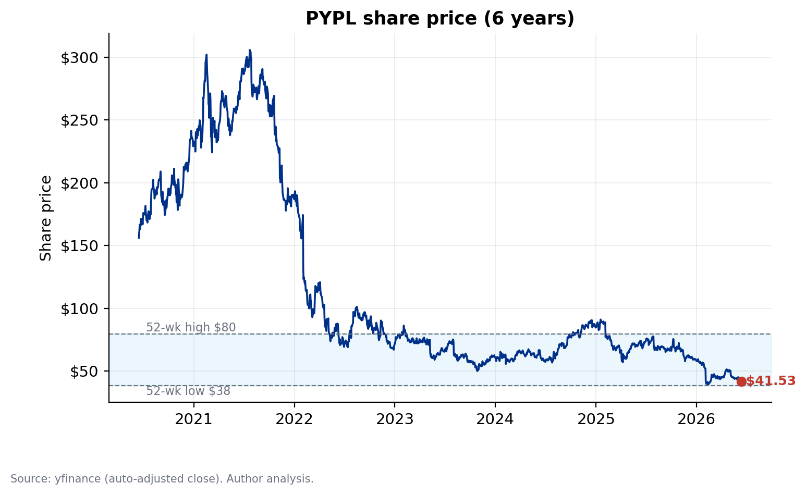
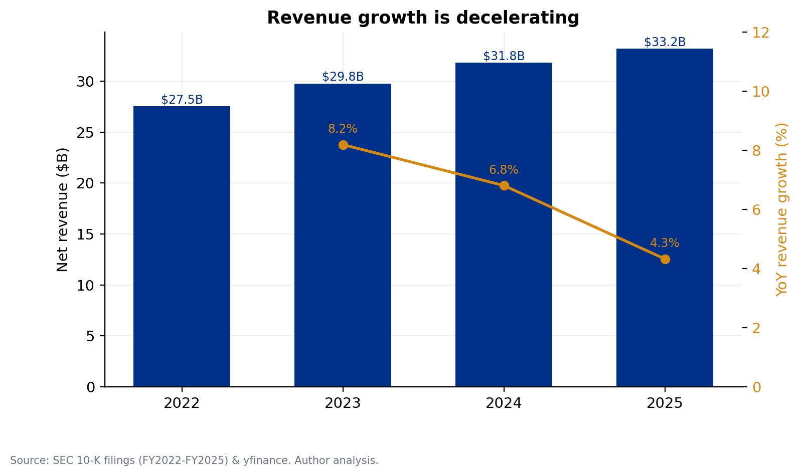
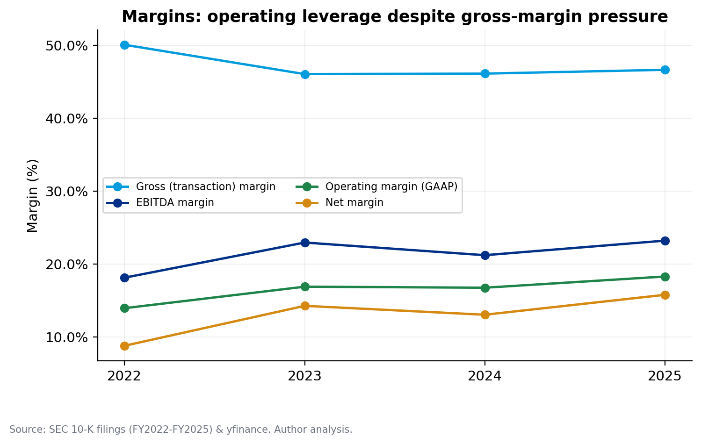
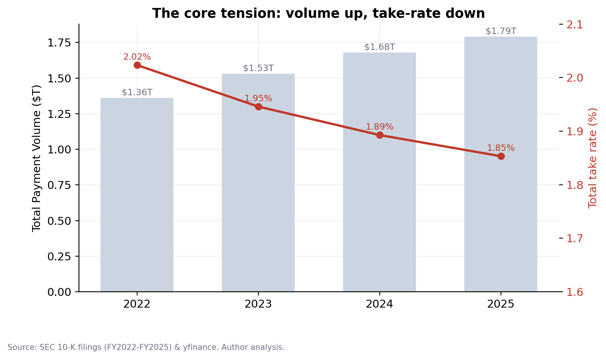
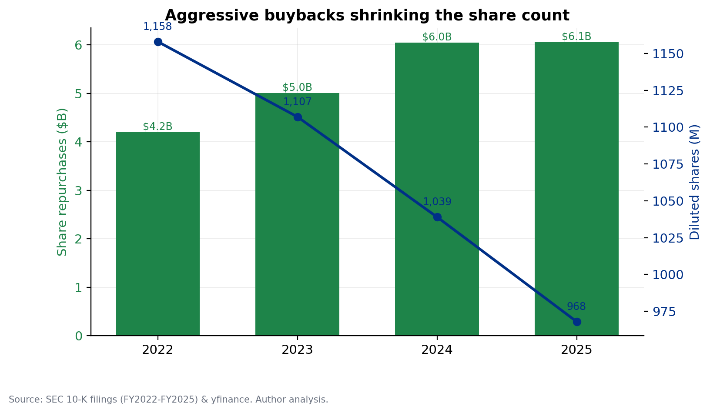
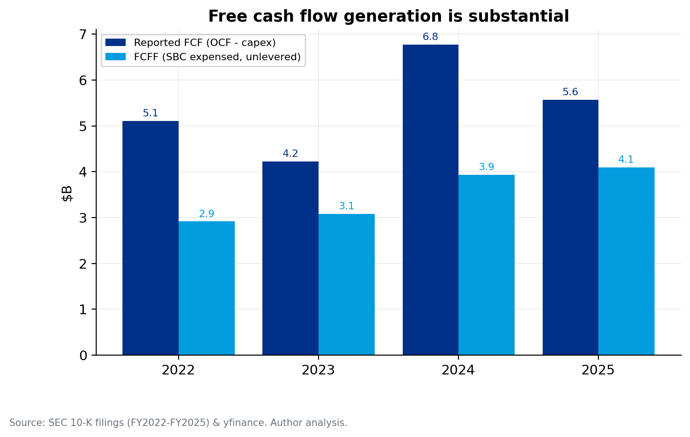
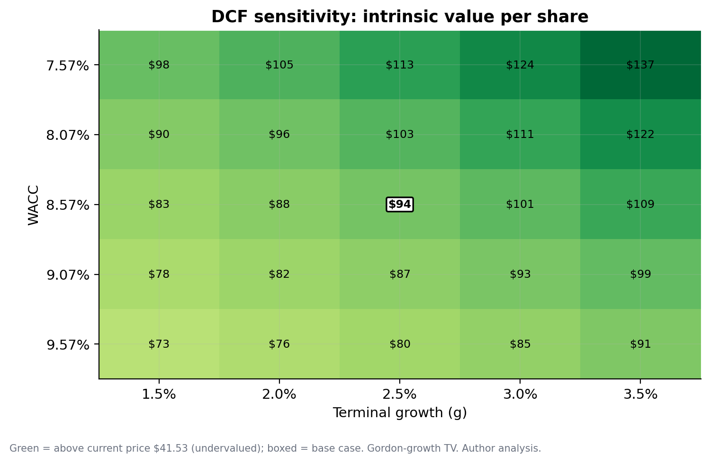
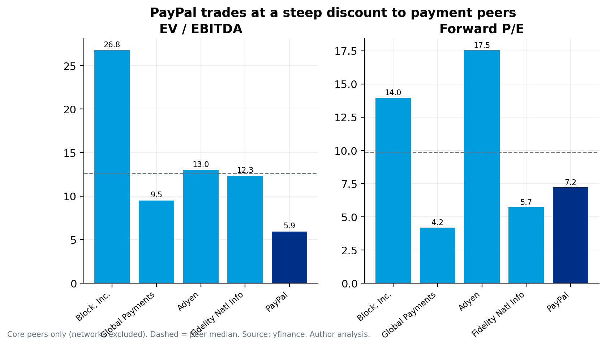
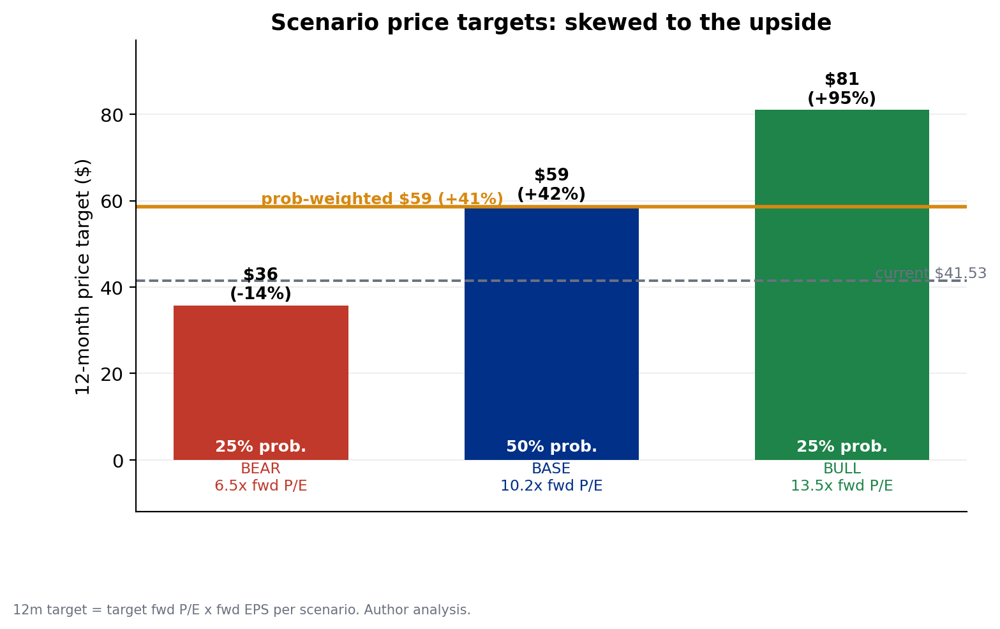
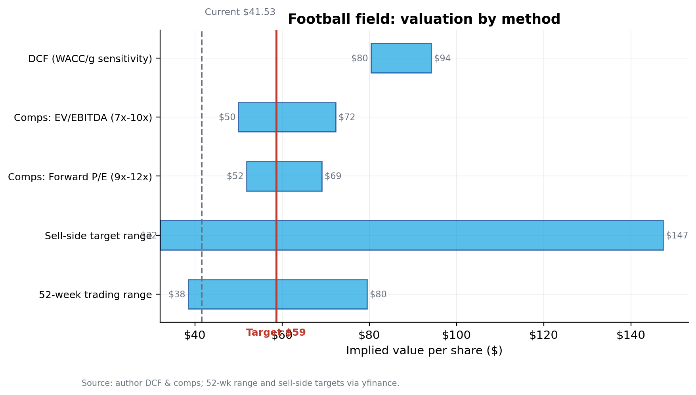

# PayPal Holdings, Inc. (NASDAQ: PYPL)

| | | | |
|---|---|---|---|
| **Rating: BUY** | **Price target: $59** | **Current: $41.53** | **Upside: +42%** |

**Sector:** Financials / Payments  **Mkt cap:** $36.6B  **EV:** ~$38.6B  **Shares out:** 882M
**Fwd P/E:** 7.2×  **EV/EBITDA:** ~6×  **FCF yield:** ~15%  **Net debt:** $1.9B (near net cash)  **52-wk:** $38.46–$79.50

## Investment summary

PayPal is the scaled incumbent of digital payments — **439 million active accounts, $1.79 trillion** of annual payment volume — trading at **7.2× forward earnings and a ~15% free-cash-flow yield**, ~85% below its 2021 peak and near a 52-week low. The market is valuing it as a structurally impaired franchise in terminal decline. We think that is wrong, and we initiate at **Buy with a $59 12-month target (+42%)**.

The bear case is real and we take it seriously: PayPal's high-margin **branded checkout** (the PayPal/Venmo button) is losing share at the checkout to Apple Pay and Shop Pay, and its blended take rate has fallen for three straight years (2.02% → 1.85%) as volume mixes toward low-margin Braintree. But three things are underappreciated:

- **The profit engine is inflecting, not collapsing.** Under CEO Alex Chriss (since Sept-2023), operating margin has expanded from 13.9% to **18.3%**, ROIC from ~9% to **~17%**, and transaction-margin dollars have re-accelerated to +5–7%. This is a deliberate shift from chasing vanity volume to compounding profit.
- **The cash returned to owners does the heavy lifting.** ~$6B/yr of buybacks (>100% of free cash flow) have shrunk the diluted share count from 1,158M to 968M (now ~882M) — **EPS has compounded from $2.09 to $5.41** even as revenue growth slowed. On a net-cash balance sheet, this is self-reinforcing at a 7× multiple.
- **The valuation embeds near-zero terminal value.** Our DCF cannot reproduce the current price under *any* plausible discount-rate / growth combination (intrinsic value $73–$137 across the sensitivity grid). The market is implicitly assuming free cash flow *declines*. We think stabilization — not heroics — is enough.

**The asymmetry is the point.** Our probability-weighted scenarios give a $59 target with a **6.8× reward-to-risk ratio**: a bull case to $81 (+95%) versus a bear case to $36 (−14%), where net cash and relentless buybacks cushion the downside. We do not need to win the checkout war — only for PayPal to not lose it outright.

---

## Investment thesis

### 1. The market is pricing structural decline that the numbers don't support

At $41.53, PayPal trades at 7.2× forward earnings and ~6× EV/EBITDA, against ~$5.6B of annual free cash flow — a ~15% FCF yield on a business that is *growing* profit and ROIC. Our base-case DCF (WACC 8.57%, terminal growth 2.5%) yields an intrinsic value of **$80–$94**. Crucially, across the entire plausible WACC (7.6–9.6%) × terminal-growth (1.5–3.5%) space, intrinsic value never falls below **$73** — the DCF *cannot* justify today's price with any positive perpetual growth (chart below). To arrive at $41.53 the market must assume either a ~12%+ cost of capital or outright FCF decline. That is a strong prior to bet against in a profitable, net-cash, category-leading franchise.

### 2. A genuine profitability inflection under new management

The story is not "growth at any cost" anymore. Since Chriss arrived, PayPal has repriced Braintree for margin rather than volume (the 10-K notes Braintree revenue rose ~$150M *despite a decline in transaction count*), cut stock-based comp from 5.0% to 3.0% of revenue, and driven GAAP operating margin from 13.9% (FY22) to **18.3% (FY25)**. Transaction-margin dollars — the metric that actually matters — went from −0.5% (FY23) to **+7.0% / +5.5%** (FY24/FY25). This is a franchise converting scale into profit, not one in run-off.

### 3. Capital returns compound the equity at a trough multiple

PayPal has repurchased ~$6B of stock annually — more than 100% of free cash flow — shrinking diluted shares ~6–7% a year. Buying back ~7% of the company at 7× earnings is intensely value-accretive *if* the business is not impaired. Combined with mid-single-digit transaction-margin growth, this supports low-double-digit FCF-per-share growth with no help from the multiple. Any re-rating is upside on top.

---

## Business overview

PayPal operates a **two-sided payments network** connecting 439 million active consumer and merchant accounts across ~200 markets, processing **$1.79 trillion** of total payment volume (TPV) and 25.4 billion transactions in FY2025. It monetizes volume at a **take rate** (revenue ÷ TPV, about 1.85%). The business has two engines:

- **Branded checkout** — the PayPal and Venmo buttons at online (and increasingly in-person) checkout. High take-rate, high-margin, and the source of the franchise's economics. This is the contested core.
- **Unbranded processing (Braintree)** — PayPal-as-a-processor for large enterprises (e.g., marketplaces and travel). Fast-growing but low take-rate; it dilutes blended economics even as it adds volume.

Around these sit **Venmo** (P2P plus a growing monetization layer — debit card, Pay-with-Venmo, business profiles), **buy-now-pay-later**, **in-person/POS**, **payouts**, and emerging vectors management explicitly names in the 10-K: **advertising-related services, agentic commerce, the PYUSD stablecoin, "PayPal World" cross-wallet interoperability, and omnichannel ("PayPal Everywhere")**. Roughly 37% of TPV is generated outside the U.S.

---

## Industry & competitive positioning

Digital payments is a large, secularly growing market (global digital-payments TPV in the tens of trillions, mid-teens % annual growth) driven by e-commerce penetration, the cash-to-digital-wallet shift, and embedded/omnichannel commerce. But competitive intensity is rising at exactly the layer where PayPal earns its best economics, and the competitive set differs by engine:

- **Branded checkout (the high-margin core)** faces two structural threats. **Apple Pay** is default-installed on every iPhone with a biometric, one-tap friction advantage and is increasingly accepted online; **Shopify's Shop Pay** is native to millions of merchant storefronts and converts at high rates. Both make PayPal's button *optional* rather than *default* — the single most important competitive dynamic for the thesis. Google Pay and "buy directly" card-on-file (Amazon, large retailers) compound the pressure.
- **Unbranded processing (Braintree)** competes with **Stripe** (private, ~$90B+ last valuation, the developer-favourite and aggressive on enterprise), **Adyen** (premium, single-platform, winning large global merchants), and **Fiserv / Global Payments / FIS** (scaled legacy acquirers). This is a price-competitive, structurally low-margin arena — which is exactly why management is repricing Braintree for margin over volume.
- **Venmo / P2P & consumer** competes with **Zelle** (bank-consortium, free, ~$1T+ volume but largely unmonetized), **Cash App** (Block — deeper monetization via Cash App Card, stock, BTC), Apple Cash, and Google. The battleground is monetizing engagement (debit, Pay-with-Venmo, business profiles) without choking usage.
- **BNPL & adjacencies**: **Affirm**, **Klarna**, **Afterpay** (Block) and **Apple Pay Later** compete with PayPal's BNPL; **Affirm/Klarna** also increasingly appear *as checkout buttons*, another vector of branded disintermediation.

**Moat assessment.** PayPal's advantage is **scale and two-sided ubiquity** — 400M+ accounts, deep merchant integration, brand trust, two decades of risk/fraud data, and a net-cash balance sheet — rather than a pricing or technology monopoly. It is a *weakening wide-ish moat*: defensible in trust, ubiquity, and risk modelling; vulnerable at the point of checkout choice. The entire investment debate is whether scale, brand, data, and new monetization (Venmo, advertising, agentic) can **stabilize** branded economics faster than Apple/Shopify erode them. Our base case requires stabilization, not victory.

---

## Financial analysis

PayPal's financials tell a consistent story: **decelerating top line, inflecting profitability, prodigious cash generation.** All figures below are validated against SEC 10-K filings (net income, share count, cash, and debt tie out exactly to EDGAR; we use the filed GAAP operating income, which differs from the data-vendor figure).

| | FY2022 | FY2023 | FY2024 | FY2025 |
|---|---|---|---|---|
| Net revenue | $27.5B | $29.8B | $31.8B | $33.2B |
| Revenue growth | — | +8.2% | +6.8% | +4.3% |
| Transaction margin $ (gross profit) | $13.8B | $13.7B | $14.7B | $15.5B |
| Operating margin (GAAP) | 13.9% | 16.9% | 16.7% | **18.3%** |
| Net income | $2.4B | $4.2B | $4.1B | $5.2B |
| Diluted EPS | $2.09 | $3.84 | $3.99 | **$5.41** |
| Free cash flow (reported) | $5.1B | $4.2B | $6.8B | $5.6B |
| Diluted shares (M) | 1,158 | 1,107 | 1,039 | **968** |
| ROIC (approx.) | 9.0% | 12.8% | 13.7% | **16.7%** |
| TPV | $1.36T | $1.53T | $1.68T | $1.79T |
| Total take rate | 2.02% | 1.95% | 1.89% | **1.85%** |

The central tension is visible in the volume-vs-take-rate split: TPV compounds double-digit while take rate erodes ~17bps over three years as mix shifts to Braintree. Management has offset this with cost discipline (operating margin +440bps) and capital returns, so *profit* and *EPS* have grown far faster than revenue.

The balance sheet is a fortress: ~$1.9B of net debt on a strict basis (total debt less cash & equivalents) and effectively **net cash** once short-term investments are included. We deliberately exclude pass-through customer funds and the consumer/merchant loans-receivable book from the corporate capital structure. Free cash flow is substantial even on our stricter, SBC-expensed, unlevered basis (~$4.1B FCFF in FY25).

---

## Valuation

We triangulate a 12-month target from a DCF, comparable companies, and probability-weighted scenarios.

### DCF

A 5-year FCFF model on the approved base case. **Free cash flow to firm treats stock-based compensation as a real expense** (it is embedded in EBIT and *not* added back) — the conservative, defensible choice for a payments/tech name.

| Assumption | Value | Benchmark / rationale |
|---|---|---|
| Revenue growth | ~4% CAGR (4.5%→3.5%) | Below FY25's +4.3%, baking in take-rate drag |
| Operating margin | ~flat 18.3%→18.7% | No heroic expansion beyond FY25 |
| Tax rate | 23% (normalized) | vs. FY25's tax-flattered 16.8%; US marginal ~24% |
| Terminal growth | 2.5% | Well below the 4% nominal-GDP cap |
| WACC | **8.57%** | Live 10Y 4.49% + beta 1.30 × ERP 4.23% (Damodaran) |
| Net debt | $1.9B (strict) | Excludes pass-through customer funds |

This yields an **intrinsic value of $80 (exit-multiple) to $94 (Gordon-growth)** per share. The sensitivity grid is the key exhibit: **every** cell exceeds the current price.

### Comparable companies

PayPal trades at a steep discount to the payments group on EV/EBITDA (~6× vs. a ~12.6× core-peer median) and below the median on forward P/E (7.2× vs. ~9.8×). Honestly, it is *not* the absolute cheapest — value-cohort peers Global Payments (4.2×) and Fidelity National (5.7×) screen lower on forward P/E — but PayPal's brand, scale, net-cash balance sheet, and superior FCF conversion argue for a re-rate toward the *middle* of the group, not the bottom. (Fiserv data was unavailable from our source at pull time and is excluded from the median.)

### Scenarios & football field

Each scenario is a coherent assumption set plus a target multiple (the thesis is fundamentally a *re-rating*, so the multiple is the swing factor over 12 months):

| Scenario | Prob. | Rev CAGR | Target multiple | 12m PT | Upside |
|---|---|---|---|---|---|
| **Bull** — branded stabilizes, Venmo/ads scale | 25% | 6.4% | 13.5× fwd | **$81** | +95% |
| **Base** — stabilization, partial re-rating | 50% | 4.1% | 10.2× fwd | **$59** | +42% |
| **Bear** — structural erosion, no re-rating | 25% | 1.2% | 6.5× fwd | **$36** | −14% |

The **probability-weighted target is $59 (+41%)**, with a **6.8× reward-to-risk** profile. We weight **50% base / 25% bull / 25% bear**: a 50% base reflects genuine uncertainty (we are not highly confident in any single path), and we hold the tails *symmetric* in probability because, while the bear's structural risk is real, the bull's optionality (Venmo, advertising, agentic) is equally unmodelled — the asymmetry we are paid for shows up in the *magnitudes* ($81 vs $36), not the odds. (A more bearish 20/45/35 weighting still yields a ~$54 target, +30%.) Note that even the bear-case *DCF intrinsic* is ~$67 — in that scenario PayPal isn't expensive, the multiple simply never cooperates (a value trap), which is why the downside is cushioned rather than catastrophic.

Our $59 target sits **above** the sell-side mean ($51.54, "Hold" consensus, range $32–$147 across 33 analysts) — a deliberately non-consensus but not heroic call — and **below** full DCF intrinsic, reflecting that a complete re-rating takes longer than 12 months.

---

## Catalysts

- **Quarterly transaction-margin-dollar growth** (next prints) — the single metric that confirms or breaks the thesis; stabilization at +5%+ is the proof point.
- **Branded checkout / Venmo monetization traction** — evidence that improved checkout UX and Venmo (debit card, Pay-with-Venmo) are re-engaging users and arresting take-rate decline.
- **Advertising and agentic-commerce launches** — optionality that is not in the multiple; early monetization would support re-rating.
- **Continued buyback execution** — ~$6B/yr at a trough multiple mechanically lifts EPS and signals capital-allocation discipline.
- **Multiple normalization** — at 7× a modest sentiment shift moves the stock materially.

## Risks & bear case

We steelman the downside rather than dismiss it. Our bear case ($36, −14%) is built on these, roughly in order of magnitude:

- **Structural checkout disintermediation (the core risk).** If Apple Pay and Shop Pay keep taking branded-checkout share, the high-margin core shrinks and the mix shift to low-margin Braintree becomes permanent — transaction-margin growth fades toward zero and the multiple stays depressed. The take-rate decline (2.02% → 1.85%, three years running) is the live evidence. *Magnitude:* this is the difference between our base and bear cases — roughly a ~5pt swing in terminal margin and the entire re-rating (10.2× vs 6.5× fwd P/E), i.e. ~$23/share.
- **Low-quality recent earnings.** FY25 net income (+26%) was flattered by a 16.8% tax rate (vs ~23% normalized) and buyback optics; transactions actually *fell 4%* and engagement softened (txns/account 60.6 → 57.7). Strip the tax tailwind and the underlying franchise grows mid-single-digits at best. *Magnitude:* normalizing tax alone removes ~$0.40–0.50 of FY25 EPS (~8%).
- **Agentic commerce & stablecoin disruption (the new, double-edged risk).** As AI agents and stablecoin rails (incl. PayPal's own PYUSD) mediate more transactions, the *checkout layer itself* could be commoditized — agents optimize for price/availability, not brand loyalty, weakening PayPal's button further. PayPal is investing here (PYUSD, "agentic commerce," PayPal World), but the same wave that is its option value could disintermediate its core. We treat this as a genuine tail risk, not just upside.
- **Venmo monetization is unproven at scale.** A material slice of the bull case rests on converting Venmo's large, engaged, but lightly-monetized base. History (years of "Venmo monetization" promises) argues for skepticism; if debit/Pay-with-Venmo/business-profile attach rates disappoint, a key growth pillar is hollow.
- **The defense costs money.** Arresting branded erosion requires spending (PayPal Everywhere rewards, checkout investment, incentives), which caps the margin-expansion thesis. A cheap stock with an eroding moat can stay cheap — or de-rate — for years; that is precisely the value-trap bear case.
- **Macro, credit & regulatory.** A consumer slowdown pressures discretionary volume; the consumer/merchant loans-receivable book carries credit-loss risk in a downturn; and payments faces rising data-privacy, interchange, and competition scrutiny (e.g., regulatory pressure on Apple's NFC/wallet defaults cuts both ways).

## Conclusion

PayPal is a category-leading, cash-generative, net-cash franchise trading at 7× earnings because the market has extrapolated take-rate erosion into terminal decline. The erosion is real, but the company is simultaneously expanding margins, compounding EPS through buybacks, and seeding new monetization — and the valuation gives it zero credit for any of it. With a probability-weighted target of **$59 (+42%)** and a **6.8× reward-to-risk** skew underpinned by a net-cash balance sheet, we initiate at **Buy**. We are not betting PayPal wins the checkout war — only that it does not lose it outright, which is all the price requires.

---

*Sources: SEC 10-K filings (FY2022–FY2025), yfinance market data, U.S. Treasury (10Y), Damodaran (ERP). All valuation outputs are reproducible from `config.yaml` via the accompanying model. Figures are author analysis unless cited. This is a student research project for portfolio purposes, not investment advice.*
